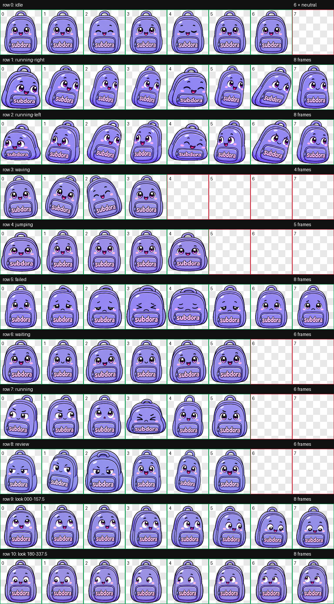

# Subdora

Subdora is a colorful, hyperactive Codex pet shaped like a lavender backpack. She gets impatient when input is needed, stays busy while work is running, and gets excited when results are ready.



## Features

- Codex v2 pet spritesheet (`1536 × 2288`)
- 9 state-specific animation loops
- 16-direction gaze loop
- Distinct waiting, working, review, failure, jump, greeting, and movement reactions
- Full-color purple eyes, pink cheeks, and readable `subdora` pocket name
- Limbless backpack design

## Install

Copy the pet files into your local Codex pets folder:

```bash
mkdir -p ~/.codex/pets/subdora
cp .codex-pet-runs/subdora/final/pet.json ~/.codex/pets/subdora/pet.json
cp .codex-pet-runs/subdora/final/spritesheet.webp ~/.codex/pets/subdora/spritesheet.webp
```

Restart Codex after installing or updating the pet.

## Files

- `pet.json` contains the pet metadata and enables sprite version 2.
- `spritesheet.webp` contains the complete 8-column × 11-row animation atlas.
- `qa/contact-sheet.png` provides a visual preview of every animation row.
